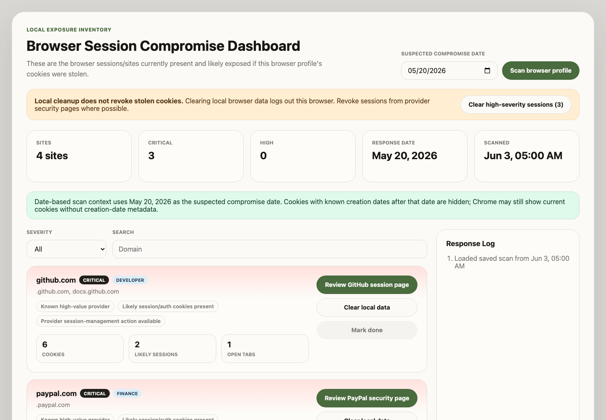

# Browser Session Compromise Dashboard

A local-only Chromium extension for Chrome, Brave, and Microsoft Edge that helps triage browser sessions after suspected cookie theft.

It inventories cookie/session indicators in the current browser profile, prioritizes high-value accounts, links to provider session/security pages where available, and lets you clear local browser cookies/site data for risky sites.



## What It Does

- Scans the current Chromium browser profile for redacted cookie metadata.
- Groups cookies and open HTTP/HTTPS tabs by site.
- Flags likely login/session cookies using conservative name-based heuristics.
- Prioritizes known high-value providers across identity, email, finance, developer, messaging, gaming, productivity, commerce, cloud, entertainment, and social categories.
- Provides provider review links for common services such as Google, Microsoft, GitHub, PayPal, Discord, WhatsApp, Steam, Stripe, Wealthfront, Betterment, Chase, Bank of America, Wells Fargo, Fidelity, Vanguard, Robinhood, and more.
- Supports an optional suspected compromise date. Cookies with known creation dates after that date are filtered out when browser metadata is available.
- Lets you mark reviewed sites as done.
- Clears local cookies/site data for one site, or bulk-clears high-severity sites with likely login sessions.
- Stores redacted scan snapshots locally so results survive dashboard reloads.

## What It Does Not Do

- It does not prove that a cookie or session was stolen.
- It does not read, display, store, export, hash, or transmit cookie values.
- It does not revoke stolen cookies from an attacker's machine.
- It does not inspect native desktop app session stores for apps like Discord, Telegram, Steam, or WhatsApp. It only sees browser-profile data.
- It does not send scan data to any server.

Local cleanup logs out this browser profile, but provider-side session revocation, password rotation, MFA review, recovery-method review, and connected-app review still need to happen on the provider's own security pages.

## Browser Compatibility

This extension is designed for Chromium-based browsers and works on Google Chrome, Brave, and Microsoft Edge. It should also work on other Chromium browsers that support Manifest V3, the `chrome.cookies`, `chrome.browsingData`, `chrome.tabs`, and `chrome.storage` APIs, and unpacked extension loading.

## Install From Source

Requirements:

- Node.js 22 or newer
- npm
- Chrome, Edge, Brave, or another Chromium browser that supports Manifest V3 extensions

Build the extension:

```bash
npm install
npm run build
```

Load it in Chrome:

1. Open `chrome://extensions`.
2. Enable Developer mode.
3. Select Load unpacked.
4. Choose the generated `dist/` folder.
5. Click the extension icon to open the dashboard.

For Edge use `edge://extensions`; for Brave use `brave://extensions`.

## How To Use It

1. Open the dashboard from the extension icon.
2. Optionally set a suspected compromise date.
3. Click Scan browser profile.
4. Review sites from highest risk to lowest risk.
5. For important accounts, open the provider review link and revoke unfamiliar sessions/devices where the provider supports it.
6. Use Clear local data for individual rows when you want to remove this browser's local cookies and storage.
7. Use Clear high-severity sessions to bulk-clear local data for `critical` and `high` rows that have likely login-session cookies.
8. Rescan after cleanup, especially if any related tabs are still open.
9. Mark rows done once local cleanup and provider-side checks are complete.

## Risk Scoring

Risk is heuristic and explainable. Rows are prioritized based on signals such as:

- Known high-value provider
- Likely session/auth cookies present
- HttpOnly, Secure, persistent, or partitioned session indicators
- Open tabs that may recreate local state
- Provider session-management action available

Cookie names are signals, not proof. CSRF-style names alone are intentionally not treated as login sessions.

## Privacy And Security Model

The extension is designed around local-only handling:

- Raw cookie values are dropped immediately by the Chrome API adapter.
- UI, storage snapshots, tests, docs, and logs must never contain cookie values.
- Stored snapshots contain only redacted metadata such as domain/site key, cookie names, flags, counts, risk, reasons, provider category/action metadata, timestamps, and reviewed state.
- Scan, scoring, storage, and cleanup do not require network requests.
- Provider links are normal user-clicked links that open in a tab.

The extension requests broad host permissions because Chrome only exposes cookies for hosts the extension can access. This is sensitive, but without broad host access the scan would produce a misleading partial inventory.

See [docs/security-model.md](docs/security-model.md) and [docs/chrome-web-store-submission.md](docs/chrome-web-store-submission.md) for the full security and store-submission notes.

## Development

Run tests:

```bash
npm test
```

Run typechecking:

```bash
npm run typecheck
```

Build:

```bash
npm run build
```

Run production dependency audit:

```bash
npm audit --omit=dev
```

Manual browser QA is documented in [docs/manual-qa.md](docs/manual-qa.md).

## Project Structure

- `src/core/`: redacted domain model, session classifier, provider directory, risk scoring, inventory builder.
- `src/background/`: MV3 service worker, Chrome API wrappers, cookie/tab collection, local cleanup.
- `src/storage/`: redacted scan snapshot persistence.
- `src/ui/`: dashboard rendering, controls, and styling.
- `public/`: Manifest V3 manifest and extension icon assets.
- `docs/`: security model, compatibility notes, QA checklist, submission checklist, and implementation notes.

## License

GPL-3.0. See [LICENSE](LICENSE).
